# Enterprise-Identity-Endpoint-Management-Lab
## Project Overview
This project demonstrates core Microsoft Entra ID (Azure Active Directory) identity and access management tasks in a Microsoft 365 Developer tenant. The lab focuses on user lifecycle managment, security groups, role-based access control (RBAC), Conditional Access, licensing, password management, and auditing.This project simulates common responsibilities performed by IT support, Help Desk, Systems Administrations, and Identity & Access Managment (IAM) administrators.

## Technologies Used
- Micrsosft Entra ID
- Microsoft 365 Admin Center
- Microsoft 365 Developer Tenant
- Micrsoft Entra Admin Center
- Git
- Github
- Visual Studio Code

## Skills Demonstrated
- User Account Adminsitration
- Security Group Management
- Password Reset
- Enable/Disable User Accounts
- Microsoft 365 License Asssignment
- User Property Management
- Role-Based Access Control (RBAC)
- Conditional Access Policies
- Audit Log Monitoring
- Identity Administration
- Documentation
- Git & GitHub Version Control

## Lab Tasks Completed

### User Administration
- Created Microsoft Entra ID users
- Updated user properties
- Reset user passwords
- Enabled and disabled user accounts
  
### Group Management
- Created Security Groups
- Assigned users to groups
- Verified group memberships

### License Management
- Assigned Microsoft 365 licenses
- Verfied license assignments
  
### User Managment 
- created multiple Microsoft Entra ID users
- Updated user properties
- Enabled and disabled user accounts
- Reset user passwords

### Group Management
- Created security groups
- Added users to security groups
- Verified group memberships

### Identity Administration
- Managed the User Administrator role
- Verified role assignments

### Role-Based Access control (RBAC)
- Assigned the user Administrator role 
- Verfied role assignments

### Conditional Access
- Created an MFA policy for administrators
- Configured policy in Report-only mode
- Applied policy to administrator role

### Monitoring
- Reviewed Microsoft Entra Audit Logs
- Verified administrative activities

## Screenshots
### Microsoft Entra Overview

### Micrsoft 365 Admin Center

## User Management 

### All Users
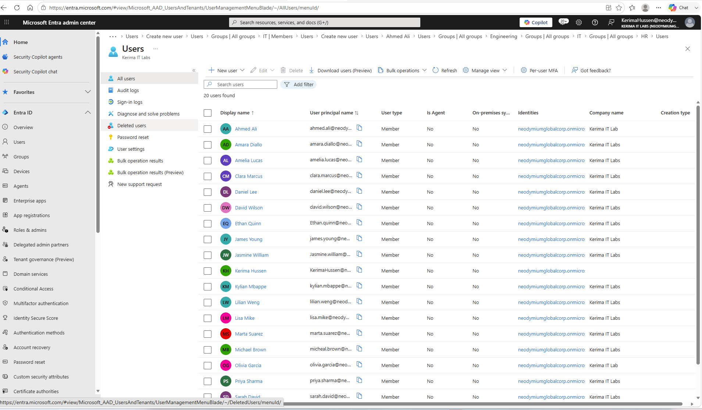

### Create First User
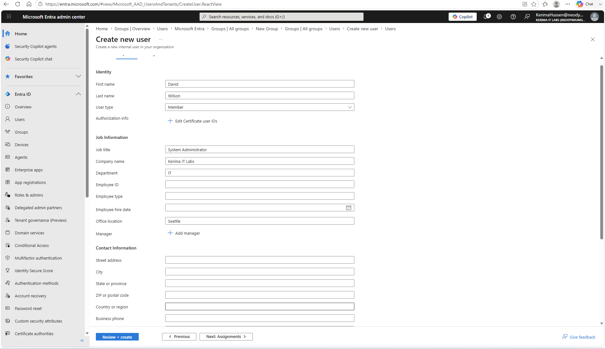

### User Overview
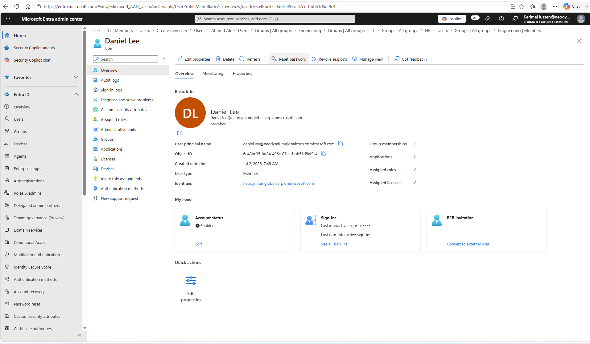

### Edit User Properties

### Updated User Profile
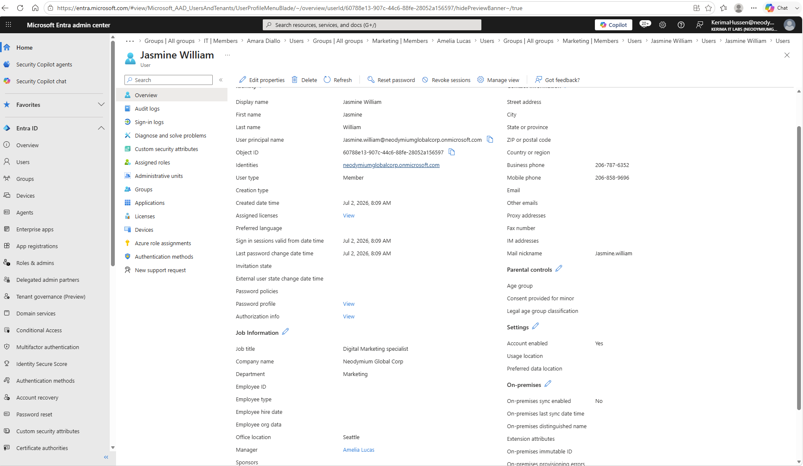

### Password Reset
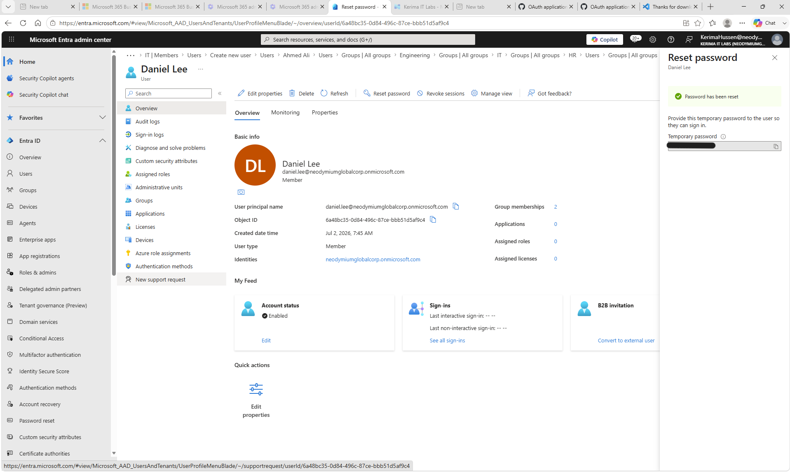

### Enable User
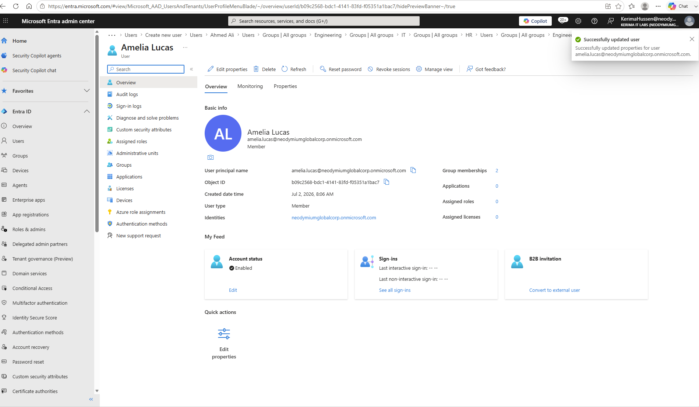

### Disable User
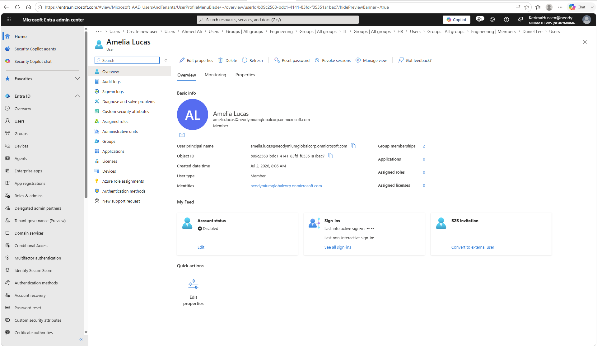

## Group Management 

### Creating Security Groups
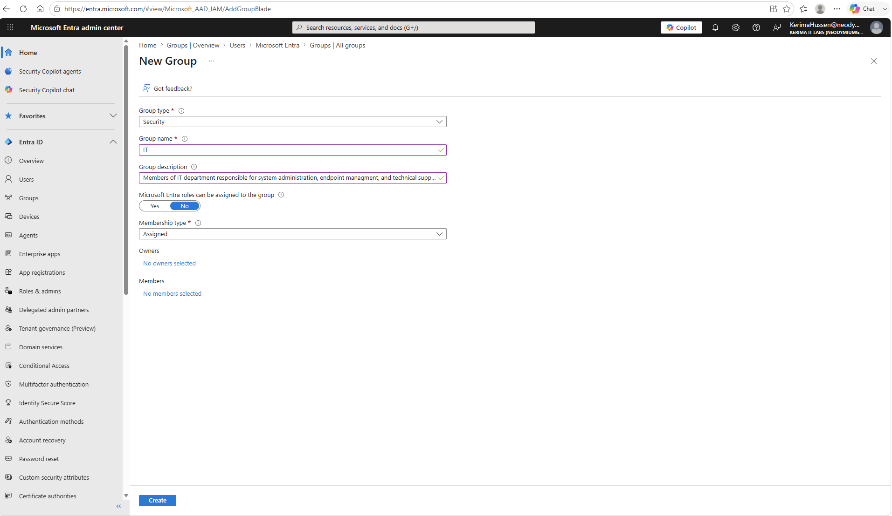

### Assigning Users to IT Groups
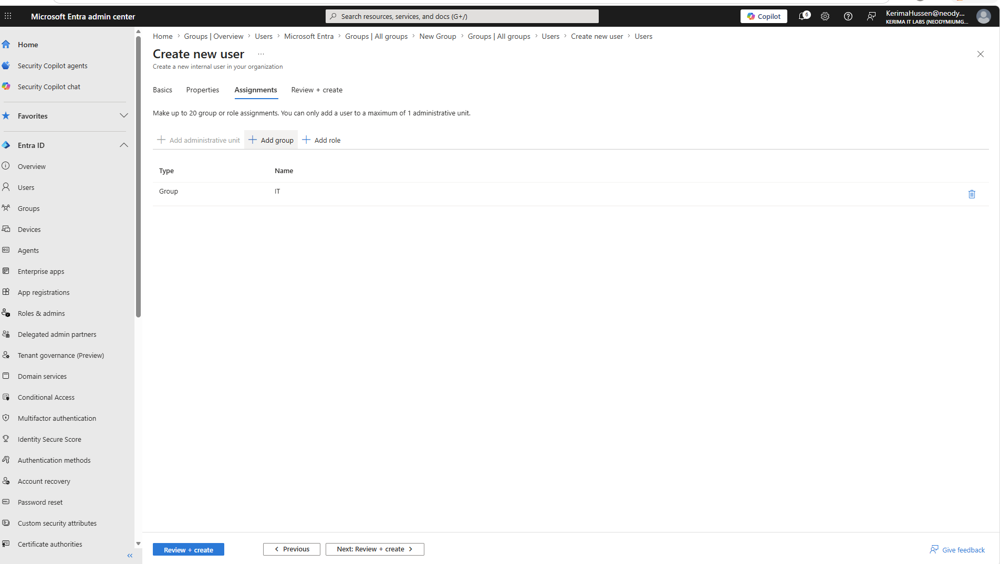

### Engineering Group Members
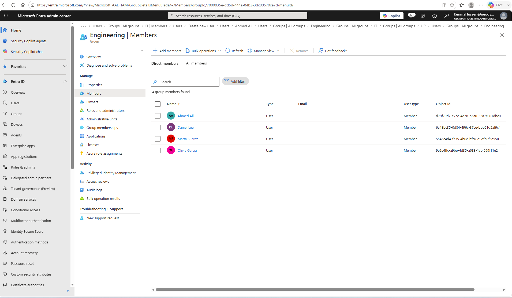

### Security Groups
.png)

## Liecense Management 

### Before License Assignment

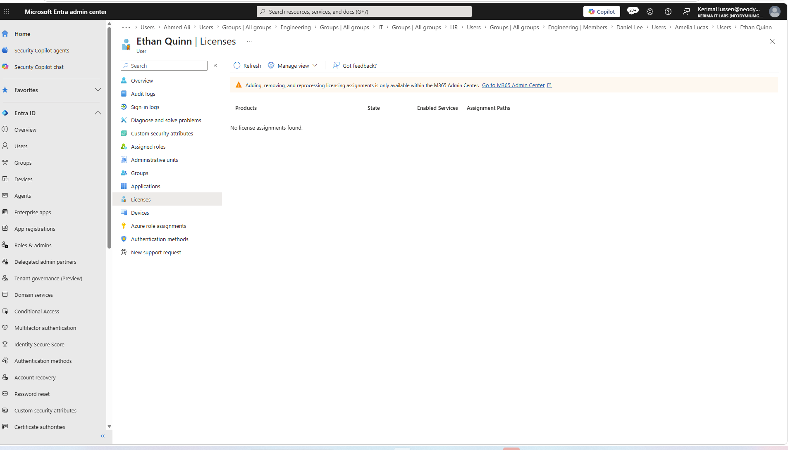

### Assigned License

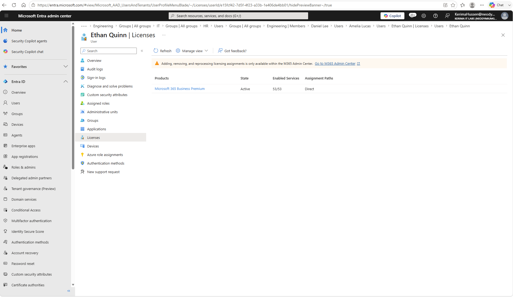

## Role-Based Access Control (RBAC)

### User Administrator Role Assignment
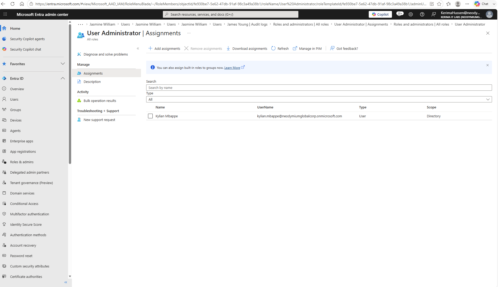

## Conditional Access

### Create Conditional Access Policy 
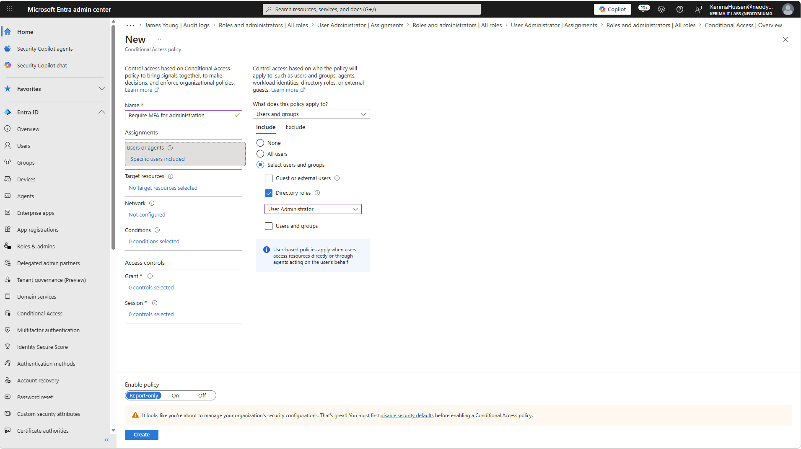

### Conditional Access Policy Created
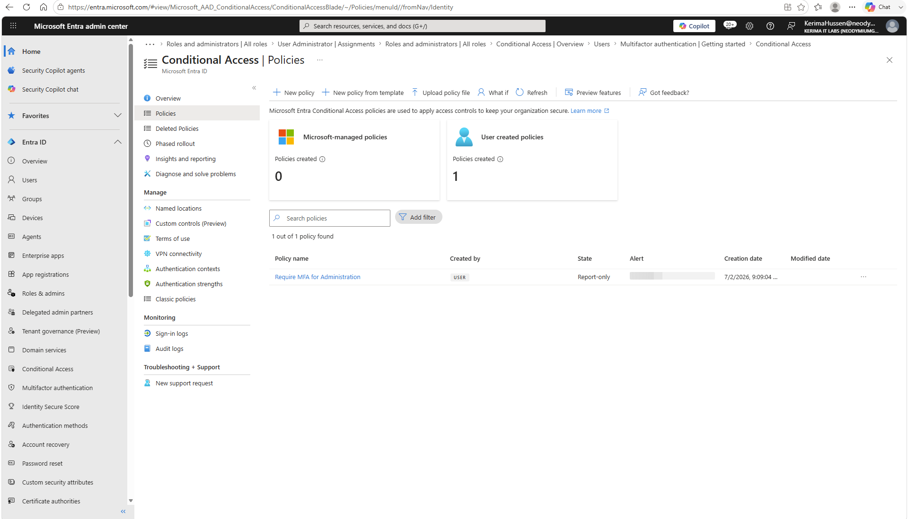

## Auditing

### Audit Log Details
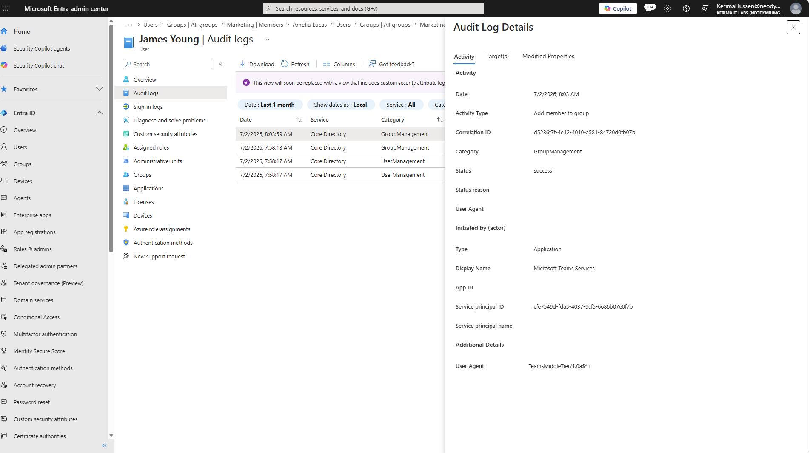
