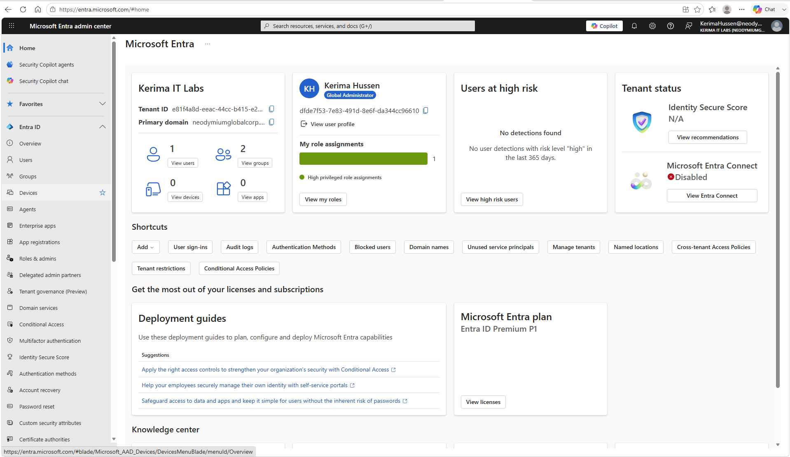

# Enterprise-Identity-Endpoint-Management-Lab
## Project Overview
This project demonstrates core Microsoft Entra ID (Azure Active Directory) identity and access management tasks in a Microsoft 365 Developer tenant. The lab focuses on user lifecycle managment, security groups, role-based access control (RBAC), Conditional Access, licensing, password management, and auditing.This project simulates common responsibilities performed by IT support, Help Desk, Systems Administrations, and Identity & Access Managment (IAM) administrators.

## Technologies Used
- Micrsosft Entra ID
- Microsoft 365 Admin Center
- Microsoft 365 Developer Tenant
- Micrsoft Entra Admin Center
- Git
- Github
- Visual Studio Code

## Skills Demonstrated
- User Account Adminsitration
- Security Group Management
- Password Reset
- Enable/Disable User Accounts
- Microsoft 365 License Asssignment
- User Property Management
- Role-Based Access Control (RBAC)
- Conditional Access Policies
- Audit Log Monitoring
- Identity Administration
- Documentation
- Git & GitHub Version Control

## Lab TakesCompleted
### User Managment 
-created multiple Microsoft Entra ID users
- Updated user properties
- Enabled and disabled user accounts
- Reset user passwords

### Group Management
- Created security groups
- Added users to security groups
- Verified group memberships

### License Managment
- Assigned Microsoft 365 licenses
- Verified license assignments

### Role-Based Access control (RBAC)
- Assigned the user Administrator role 
- Verfied role assignments

### Conditional Access
Created a Conditonal Access policy:

- Require MFA for Administration
- Applied to administrator role
- Configured in Report-only mode

## Screenshots
### Microsoft Entra Overview

### Micrsoft 365 Admin Center

### Creating Users

### Assigning Users to Groups

### 
  
